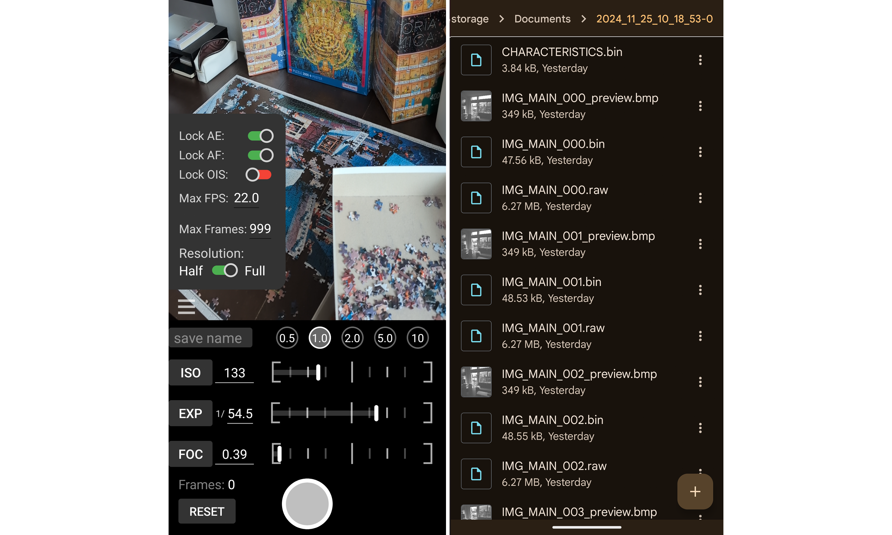

# Pani: Android App for RAW Capture
This capture app was originally developed for: [Neural Light Spheres for Implicit Image Stitching and View Synthesis](https://light.princeton.edu/publication/neuls/). If you use it, or parts its code, please considering citing our paper:

```
@inproceedings{chugunov2024light,
author = {Chugunov, Ilya and Joshi, Amogh and Murthy, Kiran and Bleibel, Francois and Heide, Felix},
title = {Neural Light Spheres for {Implicit Image Stitching and View Synthesis}},
booktitle = {Proceedings of the ACM SIGGRAPH Asia 2024},
year = {2024},
publisher = {ACM},
doi = {10.1145/3680528.3687660},
url = {https://doi.org/10.1145/3680528.3687660}
}
```

Pani is a *heavily* modified version of the [camera2basic](https://github.com/android/camera-samples/tree/main/Camera2Basic) app, built to simultaneously record 12MP RAW image data, pretty much all exposed camera/image metadata, and gyroscope + accelerometer measurements. 

**Warning:** I am still actively working on this app, it crashes sometimes for reasons beyond my understanding, and sometimes for reasons beyond human understanding. Handle with care.

**This code is built/tested for Pixel 6(a-Pro), 7(a-Pro), 8Pro, 9Pro.** Feel free to send error logs for other devices and I'll do my best to make the app crash less.

## Installing the App
1. If your device does not lock installing applications from unknown sources, you can just directly install `Pani.apk` (see: releases)
2. Otherwise, you should [enable developer mode on your device](https://developer.android.com/studio/debug/dev-options), open this project in [android studio](https://developer.android.com/studio), build, and install
  
Alternatively, thanks to [IzzySoft](https://github.com/IzzySoft), you can also find this app on IzzyOnDroid:  
  
<a href="https://apt.izzysoft.de/fdroid/index/apk/com.android.example.camera2.basic/" style="text-decoration: none;">
  
</a>


## Using the App
                                                                       

1. Swipe from the left of the screen to access the settings menu. This menu contains:
    * Physical/ISP camera selection
    * `Lock AE` → Lock autoexposure during capture
    * `Manual E` → Set manual exposure, auto-populates ISO and exposure time to the most recent autoexposure values
    * `Lock AF` → Lock autofocus during capture, unlock this to set the app to continuous video-mode focus
    * `Manual F` → Manual set focus distance, auto-populates to most recent autofocus value
    * `Lock OIS` → Turn off optical image stabilization
    * `Max FPS` → Max framerate at which data will be recorded, most camera streams only support a max of 30 or 60 depending on the device
    * `Max Frames` → App ends recording after this number of frames (e.g., useful for capturing a dataset of exactly 42-frame bursts)
2. Below the viewfinder is a live readout of ISO, exposure time, and focus distance
3. `Descriptor` → suffix for saved data, recorded data is written to `Documents/{current-date-time}_{Descriptor}`
4. `Frames` → number of frames recorded in capture
5. `Reset` → if held, will reset the camera streat, and all menu settings to defaults
6. `Big Button` → Hold down to start capturing of data, let go to end capture; wait for viewfinder to reset before recording the next capture

## Processing the Recorded Data
1. If the capture is succesful data is written to your devices `Documents` folder, this can be found in the File browser under `Internal Storage`. A succesful capture contains a set of RAW images in `.dng` format with associated metadata in binary format, as well as `MOTION.bin` and `CHARACTERISTICS.bin`, which are the recorded IMU measurements and physical camera properties (e.g., focal length), respectively
2. [Transfer the folders to your computer](https://support.google.com/android/answer/9064445)
3. Use `convert_files.py` to convert captured data into a `.npz` numpy dictionary file via  

    ```python3 convert_files.py -d {path_to_capture_folder}```  

    This can also be used to batch convert a folder of capture folders by pointing `-d` to the parent path

4. To understand the format of the output `frame_bundle.npz`, which contains combined image, IMU measurements, and metadata, see the tutorial in `data_format.ipynb`


## FAQ / Known Issues / Things to Watch Out For / "Features"

* App sometimes hangs and/or crashes. If a folder does not contain `CHARACTERISTICS.bin`, the last save file, you can assume data recording was interrupted and the capture is incomplete
* When `Manual E` is set, the viewfinder slightly dims. I think this is a bug with the camera2 preview stream, as the recorded data will appear brighter than the viewfinder
* Don't select a camera that your phone does not have (e.g., telephoto on a Pixel 6a), app will crash
* **Physical camera IDs are hard-coded.** They should be correct for most Pixel devices, but I have not tested any other Android phones. Due to the non-trivial problem of determining which camera ID corresponds to which camera, these values are set in the radio button selector section of `CameraFragment.kt` (approx. lines 500-550). If they are wrong I recommend just manually testing numbers 1-10, it's easier than trying to dig through camera characteristics
* To avoid accidental rotations, the app assumes you are recording in portrait mode, and .dng files will always be in portrait orientation
* If it's behaving weird try turning the app off and on again

## Acknowledgment
This app was initially developed during my (ilya) summer 2023 Google internship, with a lot of support from my managers (Francois Bleibel and Kiran Murphy) and the wider Gcam team. A big thanks to them for making this project possible.

The original code this is based on is from [https://github.com/android/camera-sample](https://github.com/android/camera-sample) and is licensed under Apache 2.0 by The Android Open Source Project, see `NOTICE` for a copy of their license.

Good luck,  
Ilya

